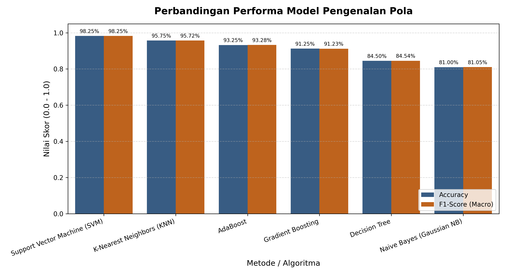
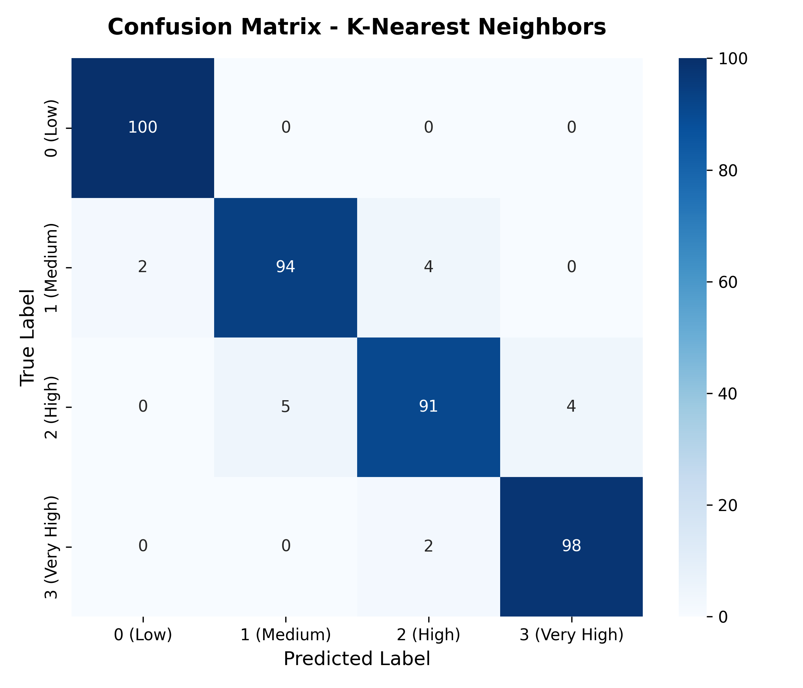
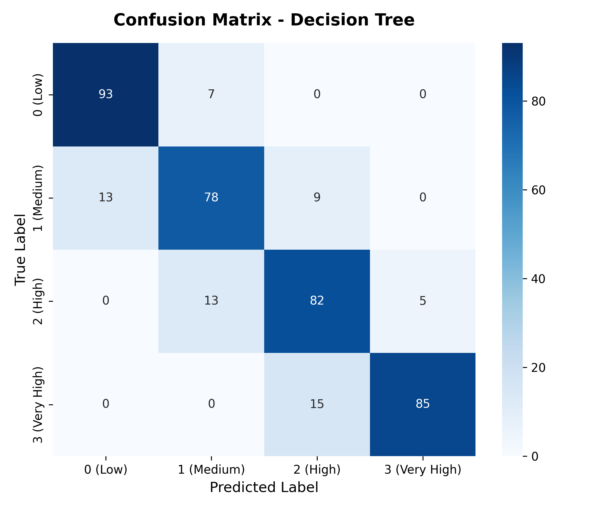
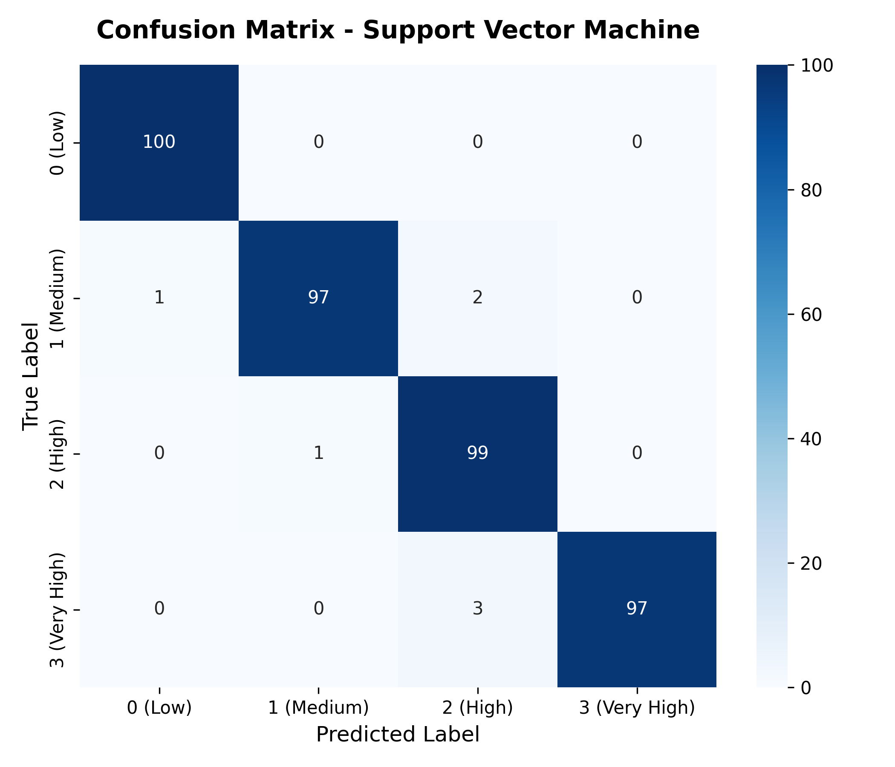
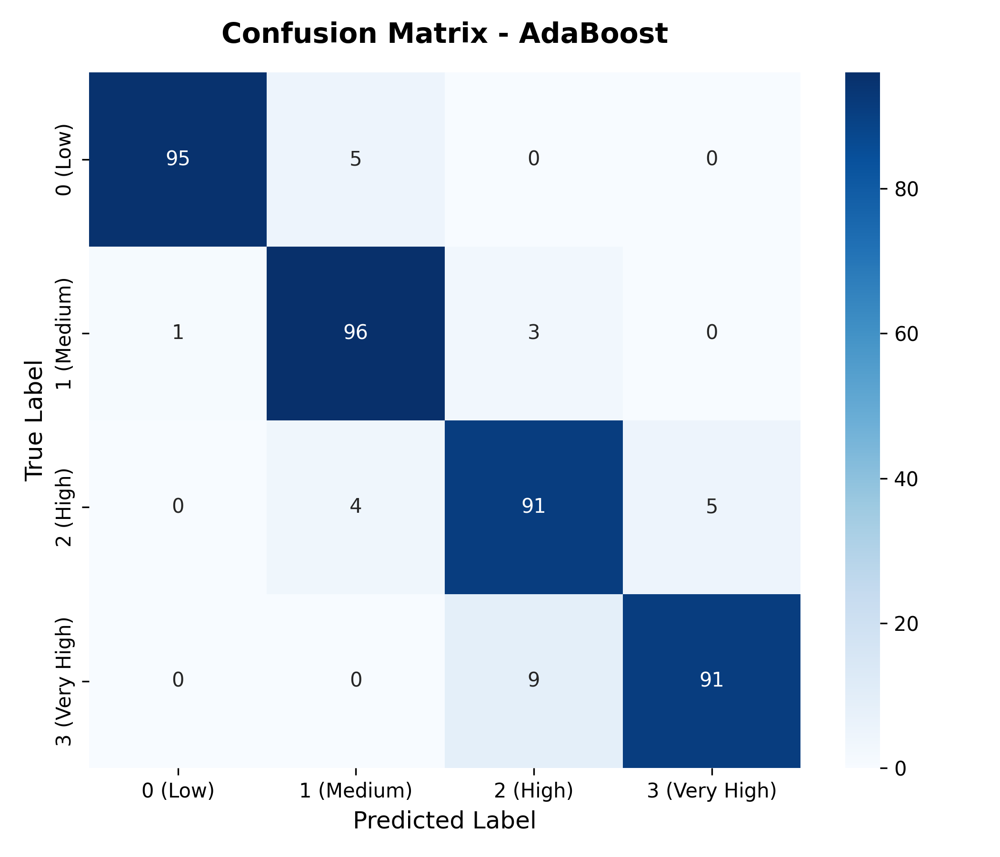

# Tugas Pengenalan Pola — Mobile Price Classification

Implementasi 6 algoritma klasifikasi Machine Learning untuk tugas mata kuliah Pengenalan Pola.  
Dataset: [Mobile Price Classification](https://www.kaggle.com/datasets/iabhishekofficial/mobile-price-classification)

---

## Quick Start

```bash
# 1. Install dependensi
pip install -r requirements.txt

# 2. Jalankan seluruh model sekaligus (benchmark)
python main.py

# 3. Jalankan satu metode spesifik
python run_single.py --model knn
python run_single.py --model decision_tree
python run_single.py --model naive_bayes
python run_single.py --model svm
python run_single.py --model gradient_boosting
python run_single.py --model adaboost
```

---

## Hasil Performa (Validation Set — Stratified 80:20)

| Rank | Metode                    | Accuracy   | Precision  | Recall     | F1-Score   | Waktu Training |
|------|---------------------------|------------|------------|------------|------------|----------------|
| 1    | Support Vector Machine    | **98.25%** | **98.30%** | **98.25%** | **98.25%** | ~9 detik       |
| 2    | K-Nearest Neighbors       | 95.75%     | 95.72%     | 95.75%     | 95.72%     | <0.01 detik    |
| 3    | AdaBoost                  | 93.25%     | 93.38%     | 93.25%     | 93.28%     | ~1.8 detik     |
| 4    | Gradient Boosting         | 91.25%     | 91.24%     | 91.25%     | 91.23%     | ~3.5 detik     |
| 5    | Decision Tree             | 84.50%     | 84.78%     | 84.50%     | 84.54%     | ~0.02 detik    |
| 6    | Naive Bayes (Gaussian NB) | 81.00%     | 81.13%     | 81.00%     | 81.05%     | <0.01 detik    |

---

<<<<<<< HEAD
## Grafik Perbandingan Performa



---

## Confusion Matrix Per Metode

| K-Nearest Neighbors | Decision Tree |
|---|---|
|  |  |

| Naive Bayes | Support Vector Machine |
|---|---|
|  |  |

| Gradient Boosting | AdaBoost |
|---|---|
|  |  |

---

## Kesimpulan

### Performa Umum

Keenam algoritma berhasil mengklasifikasikan rentang harga ponsel dengan akurasi di atas 80%. Distribusi kelas yang seimbang (500 sampel per kelas) dan dominasi fitur `ram` (korelasi 0.917 dengan target) membuat dataset ini relatif mudah diklasifikasikan oleh sebagian besar metode.

### Analisis Per Metode

**Support Vector Machine (98.25% — Terbaik)**  
SVM dengan kernel linear menghasilkan akurasi tertinggi karena batas keputusan antar kelas pada dataset ini bersifat hampir linear di ruang fitur aslinya. Tanpa normalisasi, SVM memanfaatkan dominasi fitur `ram` secara alami. Kelemahan utamanya adalah waktu training yang lebih lama (~9 detik) dibanding metode lain.

**K-Nearest Neighbors (95.75%)**  
KNN tanpa scaling menghasilkan akurasi sangat tinggi karena fitur `ram` mendominasi perhitungan jarak Euclidean secara menguntungkan. Penerapan StandardScaler justru menurunkan akurasi secara drastis menjadi ~56%, karena menghilangkan dominasi `ram` yang informatif. KNN merupakan pilihan optimal jika kecepatan training diutamakan.

**AdaBoost (93.25%)**  
AdaBoost dengan pohon base estimator berkedalaman 3 memberikan performa lebih baik dari Gradient Boosting. Mekanisme pembobotan sampel adaptif membantu model fokus pada kasus-kasus yang sulit, terutama batas antara kelas medium dan high. Penggunaan algoritma SAMME memastikan kompatibilitas multi-kelas yang stabil.

**Gradient Boosting (91.25%)**  
Gradient Boosting secara konsisten menghasilkan akurasi kompetitif pada berbagai dataset. Pada dataset ini performanya sedikit di bawah AdaBoost karena hyperparameter default (learning_rate=0.1, depth=3) belum dioptimasi lebih lanjut. Penambahan n_estimators atau penyesuaian learning_rate berpotensi meningkatkan hasilnya.

**Decision Tree (84.50%)**  
Decision Tree menghasilkan akurasi yang wajar dengan waktu training yang sangat cepat. Keterbatasannya terletak pada kecenderungan overfitting jika kedalaman pohon tidak dibatasi. Fitur `ram` secara konsisten dipilih sebagai split pertama (root node) oleh algoritma CART.

**Naive Bayes (81.00% — Terendah)**  
Naive Bayes menghasilkan akurasi terendah karena dua asumsi utamanya dilanggar: (1) asumsi independensi antar fitur tidak terpenuhi, karena beberapa fitur berkorelasi satu sama lain, dan (2) asumsi distribusi Gaussian tidak berlaku untuk fitur biner seperti `blue`, `dual_sim`, dan `four_g`. Meski demikian, Naive Bayes tetap berguna sebagai baseline yang cepat dan ringan.

### Rekomendasi Penggunaan

| Kebutuhan | Rekomendasi |
|---|---|
| Akurasi tertinggi | Support Vector Machine (kernel linear) |
| Akurasi tinggi dengan training cepat | K-Nearest Neighbors |
| Model yang mudah diinterpretasikan | Decision Tree |
| Baseline yang ringan dan cepat | Naive Bayes |
| Ensemble yang seimbang | AdaBoost atau Gradient Boosting |

---

=======
>>>>>>> 024c6b6c23e59afd6afe1a94c4bdea91d759996d
## Struktur Proyek

```
Tugas/
├── src/
│   ├── config.py               # Konfigurasi path & konstanta
│   ├── data_loader.py          # Utilitas pemuatan dan pembagian data
│   ├── evaluation.py           # Metrik & visualisasi evaluasi
│   └── models/
│       ├── __init__.py         # Model registry & factory
│       ├── base_model.py       # Abstract base class
│       ├── knn_model.py        # K-Nearest Neighbors
│       ├── decision_tree_model.py
│       ├── naive_bayes_model.py
│       ├── svm_model.py        # Support Vector Machine
│       ├── gradient_boosting_model.py
│       └── adaboost_model.py
├── outputs/
│   ├── predictions/            # Prediksi test.csv per model
│   └── figures/                # Confusion Matrix & grafik perbandingan
├── docs/                       # Penjelasan kode per metode (per file)
├── train.csv                   # Dataset pelatihan (2000 sampel, 20 fitur)
├── test.csv                    # Dataset pengujian (1000 sampel, tanpa label)
├── main.py                     # Runner semua model sekaligus
├── run_single.py               # Runner satu metode dengan argumen CLI
├── requirements.txt
└── PANDUAN_PENGGUNAAN.md       # Dokumentasi lengkap & panduan akademis
```

---

## Dokumentasi Lengkap

- [PANDUAN_PENGGUNAAN.md](PANDUAN_PENGGUNAAN.md) — Teori per metode, panduan eksekusi, interpretasi metrik
- [docs/](docs/README.md) — Penjelasan kode baris per baris per metode
